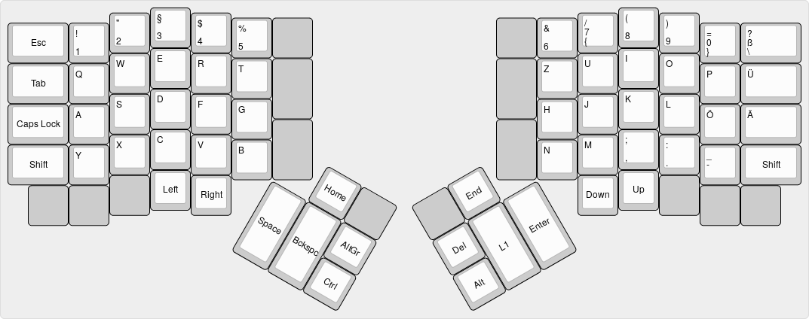

# ergodox-keymap

> my layout for the [Ergodox EZ](https://ergodox-ez.com/) keyboard

## Layers

### Default Layer

[Open on
keyboard-layout-editor.com](http://www.keyboard-layout-editor.com/#/gists/653d93558be4f61e4d84f799685d7ce2)



### Symbols Layer

[Open on
keyboard-layout-editor.com](http://www.keyboard-layout-editor.com/#/gists/929d01dc7c994a25b402e41b52e3d16d)


## Inspired by

* https://github.com/naps62/ergodox-layout/
* https://github.com/ianlewis/ergodox_keymap/
* https://implementsblog.com/2016/10/16/my-ergodox-ezs-custom-layout/
* http://www.dialectical-computing.de/blog/blog/2017/01/29/a-better-coder-layout-for-the-ergodox-ez-keyboard/

## Build

To build the keymap you need to first download the
[qmk\_firmware](https://github.com/jackhumbert/qmk_firmware/) and
create a link to this repository.

```shell
$ git clone https://github.com/jackhumbert/qmk_firmware.git
$ cd qmk_firmware
$ ./util/qmk_install.sh
$ ln -s /path/to/ergodox-keymap keyboards/ergodox_ez/keymaps/waynee95
```

Then you can build the keymap hex file.

```shell
$ make ergodox_ez:waynee95 
```

## Flashing

Make sure you have the
[teensy\_loader\_cli](http://www.pjrc.com/teensy/loader_cli.html) installed.
Then you can flash to the Ergodox EZ. Run this command and hit
the reset button on the Ergodox EZ.

```shell
$ teensy_loader_cli -mmcu=atmega32u4 -w -v ergodox_ez_waynee95.hex
```

If you have the teensy\_loader\_cli installed, you can also build and flash the
keymap in one step.

```shell
$ make teensy keyboard=ergodox_ez keymap=waynee95
```

## License

[MIT](LICENSE)
